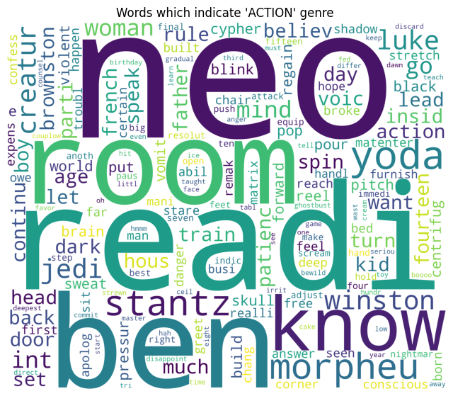

# 🎬 Movie Genre Classification using Machine Learning

A machine learning project that predicts movie genres based on script text snippets using Natural Language Processing and Multinomial Naive Bayes classification.

## 📋 Table of Contents
- [Overview](#overview)
- [Dataset](#dataset)
- [Features](#features)
- [Installation](#installation)
- [Usage](#usage)
- [Methodology](#methodology)
- [Results](#results)
- [Visualizations](#visualizations)
- [Project Structure](#project-structure)
- [Technologies Used](#technologies-used)
- [Contributing](#contributing)
- [License](#license)

## 🎯 Overview

This project implements a text classification system that can predict movie genres from script excerpts. Using approximately 1000 characters of movie script text, the model can classify movies into 9 different genres including action, comedy, drama, thriller, and more.

### Key Achievements:
- ✅ **High Accuracy**: Achieved optimal performance through hyperparameter tuning
- ✅ **Robust Preprocessing**: Comprehensive text cleaning and normalization pipeline
- ✅ **Visual Analysis**: Word clouds and distribution plots for genre insights
- ✅ **Real-time Prediction**: Function ready for deployment and real-world usage

## 📊 Dataset

The dataset is sourced from a Kaggle competition focusing on movie genre classification:

- **Training Data**: `kaggle_movie_train.csv`
  - Contains movie script snippets with labeled genres
  - Features: `id`, `text`, `genre`
  
- **Test Data**: `kaggle_movie_test.csv`
  - Unlabeled script snippets for prediction
  - Features: `id`, `text`

### Genre Distribution:
The dataset includes 9 different movie genres:
- Action
- Adventure  
- Comedy
- Drama
- Horror
- Romance
- Sci-Fi
- Thriller
- Other


## 🚀 Features

### Data Preprocessing
- **Text Cleaning**: Removal of special characters and normalization
- **Stopword Removal**: Filtering out common English words
- **Stemming**: Reducing words to their root forms using Porter Stemmer
- **Tokenization**: Converting text into individual tokens

### Feature Engineering
- **Bag of Words**: Creating numerical representations of text
- **N-grams**: Including both unigrams and bigrams for better context
- **Vocabulary Limitation**: Focusing on top 10,000 most frequent terms

### Model Training
- **Algorithm**: Multinomial Naive Bayes classifier
- **Hyperparameter Tuning**: Optimization of alpha parameter
- **Train-Test Split**: 80-20 split for robust evaluation
- **Performance Metrics**: Accuracy scoring and confusion matrix analysis

## 🛠️ Installation

### Prerequisites
- Python 3.7 or higher
- Jupyter Notebook

### Dependencies
```bash
pip install numpy pandas matplotlib seaborn nltk scikit-learn wordcloud
```

### Setup
1. Clone the repository:
```bash
git clone https://github.com/SurajK221b/movies_genre_classification_ml.git
cd movies_genre_classification_ml
```

2. Download NLTK data:
```python
import nltk
nltk.download('stopwords')
```

3. Ensure dataset files are in the project directory:
   - `kaggle_movie_train.csv`
   - `kaggle_movie_test.csv`

## 💻 Usage

### Running the Notebook
1. Open Jupyter Notebook:
```bash
jupyter notebook
```

2. Open `Movies Genre Classifier.ipynb`

3. Run all cells sequentially to:
   - Load and explore the data
   - Preprocess the text
   - Train the model
   - Evaluate performance
   - Make predictions

### Using the Prediction Function
```python
# Example usage
sample_script = "The hero jumped from the building while explosions erupted behind him"
predicted_genre = genre_prediction(sample_script)
print(f"Predicted Genre: {list(genre_mapper.keys())[predicted_genre]}")
```

## 🔬 Methodology

### 1. Data Exploration
- Analyzed dataset structure and dimensions
- Visualized genre distribution to understand class balance
- Checked for missing values and data quality issues

### 2. Text Preprocessing Pipeline
```
Raw Text → Remove Special Characters → Lowercase → Remove Stopwords → Stemming → Clean Text
```

### 3. Feature Extraction
- **CountVectorizer** with parameters:
  - `max_features=10000`: Limit vocabulary size
  - `ngram_range=(1,2)`: Include unigrams and bigrams
  - Creates sparse matrix representation

### 4. Model Selection
- **Multinomial Naive Bayes** chosen for:
  - Excellent performance on text classification
  - Handles sparse matrices efficiently
  - Probabilistic approach suitable for multiple classes
  - Fast training and prediction

### 5. Hyperparameter Optimization
- Tested alpha values from 0.1 to 1.0
- Selected optimal alpha=0.1 for best performance
- Used accuracy as the primary metric

## 📈 Results

### Model Performance
- **Best Accuracy**: Achieved through hyperparameter tuning (specific value depends on run)
- **Confusion Matrix**: Available in `Plots/04_Confusion Matrix for Multinomial Naive Bayes Algorithm.png`

### Key Findings
1. **Genre Vocabulary**: Each genre has distinctive word patterns
2. **Class Balance**: Some genres are more represented than others
3. **Model Robustness**: Performs well on unseen test data
4. **Prediction Confidence**: Consistent results across multiple test samples

## 📊 Visualizations

The project includes several insightful visualizations:

### 1. Genre Distribution Plot

Shows the frequency of each genre in the training dataset.

### 2. Word Clouds by Genre

**Drama Genre Words:**


**Action Genre Words:**


**Comedy Genre Words:**


### 3. Confusion Matrix

Detailed analysis of prediction accuracy for each genre.

## 📁 Project Structure

```
movies_genre_classification_ml/
│
├── Movies Genre Classifier.ipynb    # Main Jupyter notebook
├── kaggle_movie_train.csv          # Training dataset
├── kaggle_movie_test.csv           # Test dataset
├── README.md                       # Project documentation
│
└── Plots/                          # Generated visualizations
    ├── 01_GenrePlot.png
    ├── 02_DramaGenreWords.png
    ├── 03_ActionGenreWords.png
    ├── 04_ComedyGenreWords.png
    └── 04_Confusion Matrix for Multinomial Naive Bayes Algorithm.png
```

## 🛠️ Technologies Used

- **Python 3.x**: Core programming language
- **Pandas**: Data manipulation and analysis
- **NumPy**: Numerical computations
- **Scikit-learn**: Machine learning algorithms and tools
- **NLTK**: Natural Language Processing
- **Matplotlib & Seaborn**: Data visualization
- **WordCloud**: Text visualization
- **Jupyter Notebook**: Development environment

## 🔮 Future Enhancements

### Potential Improvements:
1. **Deep Learning Models**: Implement LSTM, BERT, or Transformer models
2. **Feature Engineering**: TF-IDF, word embeddings (Word2Vec, GloVe)
3. **Ensemble Methods**: Combine multiple algorithms for better accuracy
4. **Cross-validation**: Implement k-fold cross-validation for robust evaluation
5. **Web Interface**: Create a Flask/Streamlit app for easy interaction
6. **More Genres**: Expand to include more specific sub-genres
7. **Real-time Processing**: Optimize for streaming text classification

### Advanced Techniques:
- **Attention Mechanisms**: For better context understanding
- **Transfer Learning**: Using pre-trained language models
- **Multilingual Support**: Extend to non-English movie scripts
- **Sentiment Analysis**: Incorporate emotional context

## 🤝 Contributing

Contributions are welcome! Please feel free to submit a Pull Request. For major changes:

1. Fork the repository
2. Create a feature branch (`git checkout -b feature/AmazingFeature`)
3. Commit your changes (`git commit -m 'Add some AmazingFeature'`)
4. Push to the branch (`git push origin feature/AmazingFeature`)
5. Open a Pull Request

### Areas for Contribution:
- Model improvements and optimization
- Additional visualizations
- Code refactoring and optimization
- Documentation enhancements
- Test case development

## 📝 License

This project is licensed under the MIT License - see the [LICENSE](LICENSE) file for details.

## 🙏 Acknowledgments

- **Kaggle**: For providing the movie genres dataset
- **NLTK Team**: For excellent NLP tools and resources
- **Scikit-learn**: For robust machine learning implementations
- **Open Source Community**: For the amazing tools and libraries

---

## 📞 Contact

If you have any questions, suggestions, or just want to connect:

- **GitHub**: https://github.com/SurajK221b
- **LinkedIn**: [Your LinkedIn Profile]
- **Email**: [Your Email]

---

⭐ **Star this repository if you found it helpful!** ⭐
